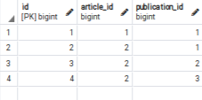
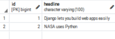
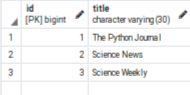
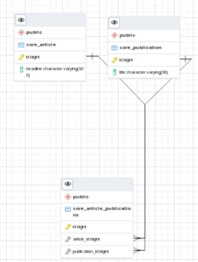

```
from django.db import models

class Publication(models.Model):
    title = models.CharField(max_length=30)

    class Meta:
        ordering = ['title']

    def __str__(self):
        return self.title

class Article(models.Model):
    headline = models.CharField(max_length=100)
    publications = models.ManyToManyField(Publication)

    class Meta:
        ordering = ['headline']

    def __str__(self):
        return self.headline
```
Create a few Publications:

```
>>> p1 = Publication(title='The Python Journal')
>>> p1.save()
>>> p2 = Publication(title='Science News')
>>> p2.save()
>>> p3 = Publication(title='Science Weekly')
>>> p3.save()
```
Create an Article:

```
>>> a1 = Article(headline='Django lets you build web apps easily')
>>> a1.save()
>>> a1.publications.add(p1)

```










Reference:
- [Django Example](https://docs.djangoproject.com/en/4.0/topics/db/examples/many_to_many/)
- [Many to Many Relation](https://fmhelp.filemaker.com/help/18/fmp/en/index.html#page/FMP_Help/many-to-many-relationships.html)
