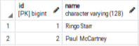
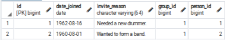

### Intermediate Many-to-Many relation

Sometimes you may need to associate data with the relationship between two models.

```
from django.db import models

class Person(models.Model):
    name = models.CharField(max_length=128)

    def __str__(self):
        return self.name

class Group(models.Model):
    name = models.CharField(max_length=128)
    members = models.ManyToManyField(Person, through='Membership')

    def __str__(self):
        return self.name

class Membership(models.Model):
    person = models.ForeignKey(Person, on_delete=models.CASCADE)
    group = models.ForeignKey(Group, on_delete=models.CASCADE)
    date_joined = models.DateField()
    invite_reason = models.CharField(max_length=64)
```

```
>>> ringo = Person.objects.create(name="Ringo Starr")
>>> paul = Person.objects.create(name="Paul McCartney")
>>> beatles = Group.objects.create(name="The Beatles")
>>> m1 = Membership(person=ringo, group=beatles,
...     date_joined=date(1962, 8, 16),
...     invite_reason="Needed a new drummer.")
>>> m1.save()
>>> m2 = Membership.objects.create(person=paul, group=beatles,
...     date_joined=date(1960, 8, 1),
...     invite_reason="Wanted to form a band.")
>>> beatles.members.all()
```






Reference
- [Django Intermediate](https://docs.djangoproject.com/en/4.0/topics/db/models/#intermediary-manytomany)